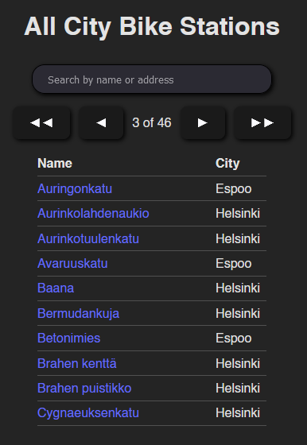
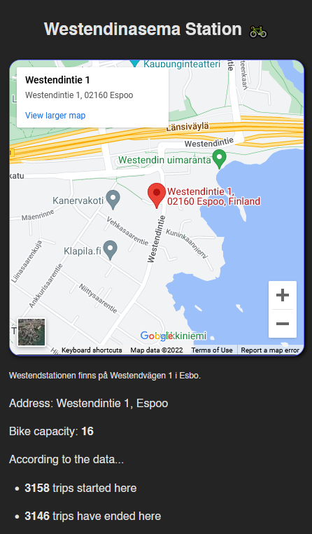

# [HEL CITY BIKE APP](https://helbikeapp.surge.sh/)

This project was created for a pre-assignment for [Solita's Dev Academy 2023](https://github.com/solita/dev-academy-2023-exercise).<br>
With this handy web app you can search through all city bike stations in the Helsinki and Espoo areas, and view information about each station.<br>
You'll also find a sortable table with all journeys taken with these city bikes in the summer of 2021.<br><br>
Tags: `react.js`, `javascript`, `rest api`, `sqlite`, `pocketbase`, `docker`, `fly.io` 

## Index

- [Run a development build of the app](#running-a-development-build-locally)
- [Frontend](#frontend)
    - [Home Page](#home-page)
    - [Pagination](#pagination)
    - [Stations List](#stations-list)
    - [Station Info](#station-info)
    - [Journeys Table](#journeys-table)
- [Backend???](#backend)
    - [Handling the data](#handling-the-data)
    - [API](#api)
- [Project Reflection](#project-reflection)
- [Licenses](#licenses)

## Running a development build locally
Requirements:
- [Node.js 18](https://nodejs.org/en/)<br>

1. Run `git clone https://github.com/vicontiveros00/Helsinki-City-Bike-App.git` in your terminal to clone the repository. (Alternatively, you could download the repo instead.)
2. Navigate to `bike-app/` and run `npm install` to install the necessary dependencies.
3. Run `npm run dev` to get a local development build running. You'll usually find the app running at http://localhost:5173/. If not, check the terminal.

The API is running on [fly.io](https://fly.io/) so there's no set up to get the backend running.

## Frontend
The frontend is built with [React.js](https://reactjs.org/) initialized with [Vite](https://vitejs.dev/) to improve performance on development builds. Frontend is responsive and works well on mobile devices as well. Check the code comments for details on components, functions, error handling, API calls, etc.<br>
Dependencies:
- [React Router](https://reactrouter.com/en/main)
- [React Spinners](https://www.npmjs.com/package/react-spinners)<br>

### [Home Page](bike-app/src/components/Home/Home.jsx)
<br>
Contains a description of the app, the longest journey in the database, and a link to my github. Should a network error occur, nothing will display above the link to my github.

### Pagination
<br>
- ◄◄ button sends users back to the first page of stations. Appears when current page is over 2.
- ◄ button sends users one page back. Appears when current page is over 1.
- ► button sends users one page forward. Appears when the current page is less than the total amount of pages.
- ►► button sends users to the last page. Appears when the current page is 2 or more less than the total amount of pages.<br>

### [Stations List](bike-app/src/components/Stations/Stations.jsx)
<br>
The searchbar allows user to search through the stations by name or address.<br>[Pagination](#pagination) is added to improve performance. 
Bellow pagination you will find a list of 10 stations sorted by name. Each row containes a link to the [station's info page](#station-info), and which city the station is located in.

### [Station Info](bike-app/src/components/StationInfo/StationInfo.jsx)
<br>
Contains the station's location on [Google Maps](https://developers.google.com/maps/documentation/embed/get-started), Swedish name and address, station's address in text, the station's bike capacity, the amount of trips started at the station in the summer of 2021, and the amount of trips ending at the station per the journeys data.

### [Journeys Table](bike-app/src/components/Journeys/Journeys.jsx)
<br>
Here is a complete table of journeys taken in the summer of 2021 on city bikes and [pagination](#pagination). By default, the data is sorted in ascending order by departure time. Clicking on the head will sort the respective column by descending order, and a second click will sort the respective column by ascending order. You are able to view information about each station from the journeys table as well.

## [Backend](api/)
You're probably wondering how the backend works. If you show massive CSV files to most other frontend developers they will most likely run away. The backend runs on a VM hosted on [fly.io](https://fly.io/) via [Docker](api/Dockerfile). It's a REST API using [Pocketbase](https://pocketbase.io/docs/), an open source way of bootstrapping a backend. It's built upon Typescript and SQLite. I might only be a front end developer, but I have some tricks to handle APIs and data. Should one want to run the API locally, navigate to `api/` and run `./pocketbase serve`. (Data has to be in `.db` format, in `api/pb_data`).

### Handling the data
CSV files were imported into Pocketbase's SQLite Database using [DB Browser](https://sqlitebrowser.org/).<br>
Schema for `stations`:<br>
<br><br>
Schema for `journeys`:<br>
<br><br>

To remove journeys that lasted for less than 10 seconds in SQL:<br>
```
DELETE
FROM journeys
WHERE distance_m < 10;
DELETE
FROM journeys
WHERE duration_s < 10;
```
<br><br>
To remove duplicate journeys (of which there were plenty) in SQL:<br>
```
DELETE FROM journeys
WHERE id IN (SELECT id FROM journey
    GROUP BY departure, return_time, departure_station_id, departure_station_name, return_station_id, return_station_name, distance_m, duration_s
    HAVING COUNT(*) > 1);
```
<br><br>
To count how many journeys started/ended at each station in SQL:<br>
```
UPDATE stations
SET num_from = (SELECT COUNT(*)
    FROM journeys
    WHERE journeys.departure_station_id = stations.id);
UPDATE stations
SET num_to = (SELECT COUNT(*)
    FROM journeys
    WHERE journeys.return_station_id = stations.id);
```

### API
[View JSON for stations here](https://helbikeappvic.fly.dev/api/collections/stations/records)<br>
[View JSON for journeys here](https://helbikeappvic.fly.dev/api/collections/journeys/records)<br>
JSON includes:
- page (current page)
- perPage (how many results per page)
- totalItems (how many total items per collection)
- totalPages (how many pages per collection)
- items (array of data following schema of respective collection)<br>
[`bike-app/src/util/apiCaller.js`](bike-app/src/util/apiCaller.js) contains some API endpoints being used.

Endpoints examples:
- `/api/collections/${stations || journeys}/records?page=${pageNumber}`
- `/api/collections/${stations || journeys}/records?perPageage=${amountPerPage}`
- `/api/collections/${stations || journeys}/records?sort=${sortMethod}`
- `/api/collections/${stations || journeys}/records?filter=(nimi=${searchQuery})`

Query parametes can be combined with `&`. Refer to [Pocketbase Docs](https://pocketbase.io/docs/) for more information.

## Project Reflection
Improvements can still be made and I will continue to maintain this codebase when I grow as a developer to apply newly acquired skills. As a frontend developer, I am pleased with the end result of this fullstack project. I managed to learn a few things here and there and that's what matters most as an aspiring developer. Thank you for your time and consideration over at Solita. Shoutout to Beata Kuśnierz for referring me to the academy and telling me everything about the greatness of being a part of Solita.

###### Licenses
Station data is owned by [HSL](https://www.avoindata.fi/data/en_GB/dataset/hsl-n-kaupunkipyoraasemat/resource/a23eef3a-cc40-4608-8aa2-c730d17e8902?inner_span=True).<br> 
Journey data is owned by [City Bike Finland](https://www.citybikefinland.fi/). 
<br>
Images are used with Creative Commons in mind.
